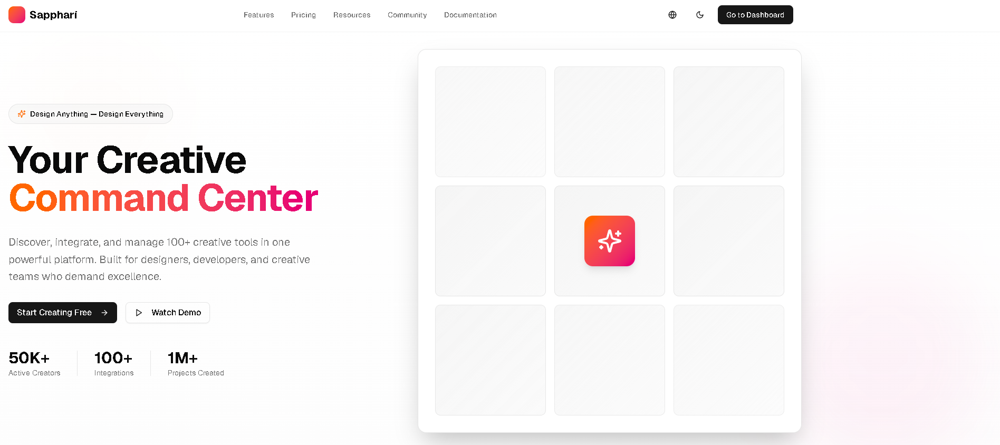
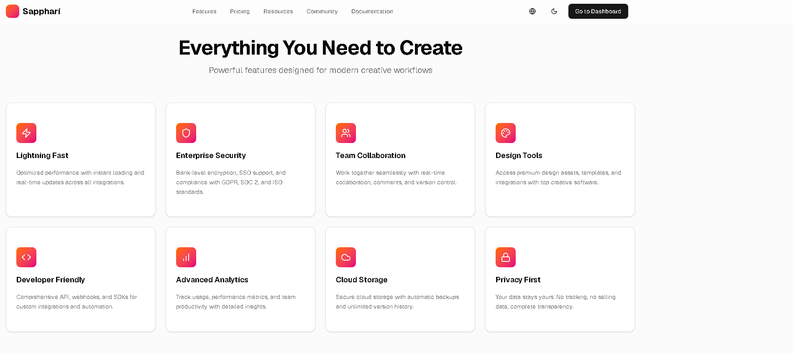
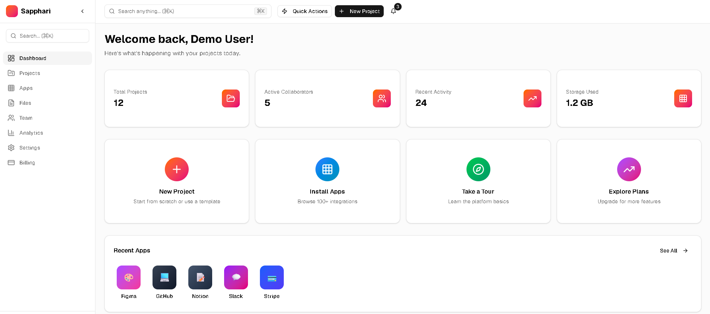
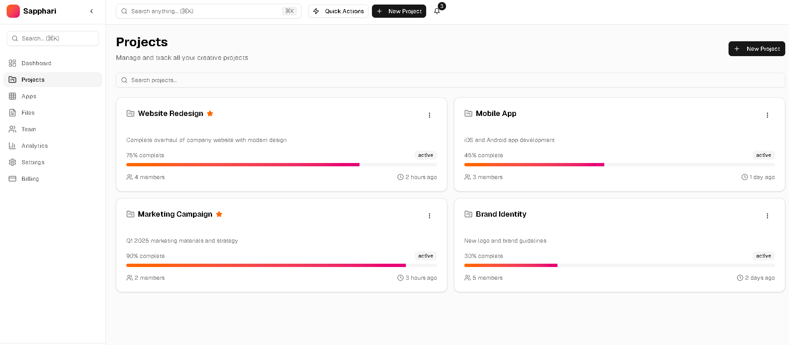

<div align="center">

# AI Creative Platform

**An AI creative platform**

[](https://nextjs.org)
[](https://www.typescriptlang.org)
[](https://tailwindcss.com)
[]()

*Turn briefs and prompts into creative assets, organized in one workspace.*

</div>

> **Available for development and custom work.** This is a working prototype / showcase. I can build and deliver the complete product - including the private production backend - or adapt it for your needs, under a development agreement. **Get in touch:** [x.com/franny_dustmast](https://x.com/franny_dustmast)


---

## What Is This?

Sapphari is an AI creative platform. Users go from a prompt or brief to generated creative assets, then organize, iterate, and export them from a project workspace.

---

## Features

| Feature | Description | Status |
|---|---|:---:|
| Creative workspace | Projects and asset library | ✅ |
| AI generation | Prompt-to-asset creation | ✅ |
| Iteration | Refine and version outputs | 🚧 |
| Export | Download and share assets | 🚧 |
| Templates | Reusable creative starting points | 🚧 |

---

## How It Works

```
Prompt / brief
     │
     ▼
AI creative engine ──▶ generated assets
     │
     ▼
Workspace (projects · library · export)
```

---

## Tech Stack

| Layer | Technology |
|-------|------------|
| Frontend | Next.js, React, TypeScript |
| Styling | Tailwind CSS, shadcn/ui |
| AI | Generation layer |

---

## Project Structure

```
sapphari-ai-creative-platform/
app/
   about/
   blog/
   careers/
   changelog/
   community/
   contact/
components/
   apps/
   ui/
   creative.tsx
   dashboard-header.tsx
   dashboard-sidebar.tsx
   features-section.tsx
hooks/
   use-mobile.ts
   use-toast.ts
lib/
   auth-context.tsx
   tools-database.ts
   utils.ts
public/
   placeholder-logo.png
   placeholder-logo.svg
   placeholder-user.jpg
   placeholder.jpg
   placeholder.svg
styles/
   globals.css
.gitignore
components.json
next.config.mjs
next-env.d.ts
package.json
pnpm-lock.yaml
postcss.config.mjs
README.md
tsconfig.json
```

---

## Screenshots

<table>
<tr><td width="50%"></td><td width="50%"></td></tr>
<tr><td width="50%"></td><td width="50%"></td></tr>
</table>

---

## Getting Started

```bash
npm install --legacy-peer-deps --ignore-scripts
npx next dev
```

---

## Notes

Shared as a portfolio artifact demonstrating product and system design. Early prototype, not a finished product.

<div align="center">

MIT

</div>
